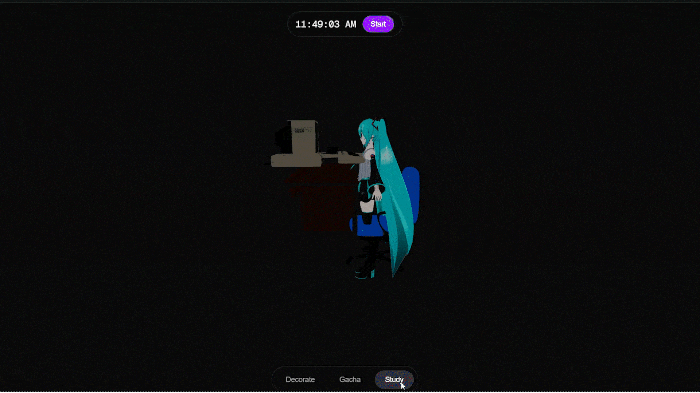
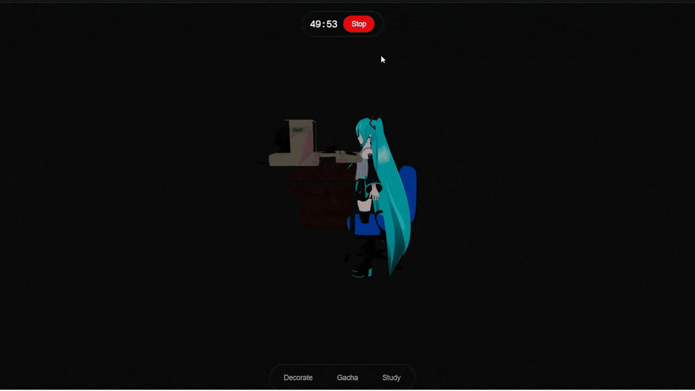
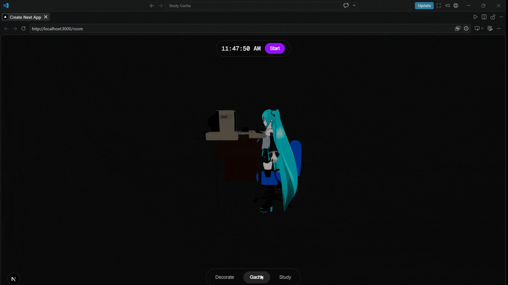
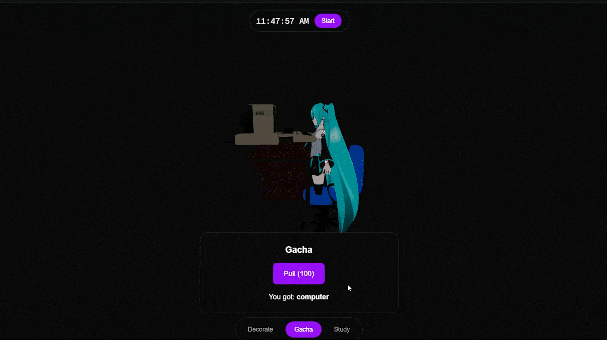
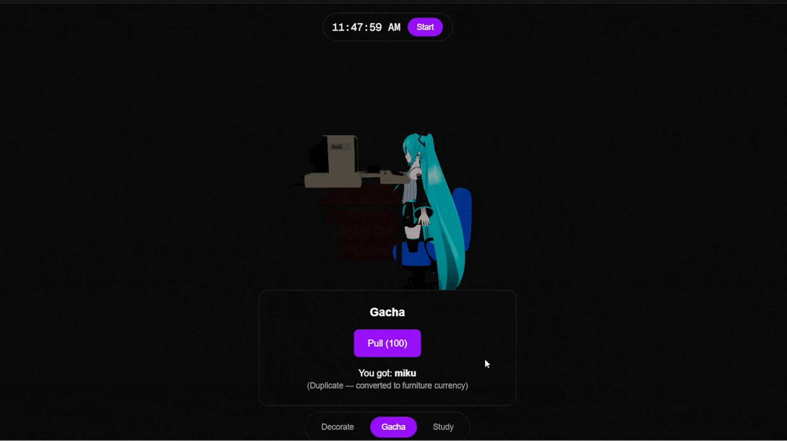
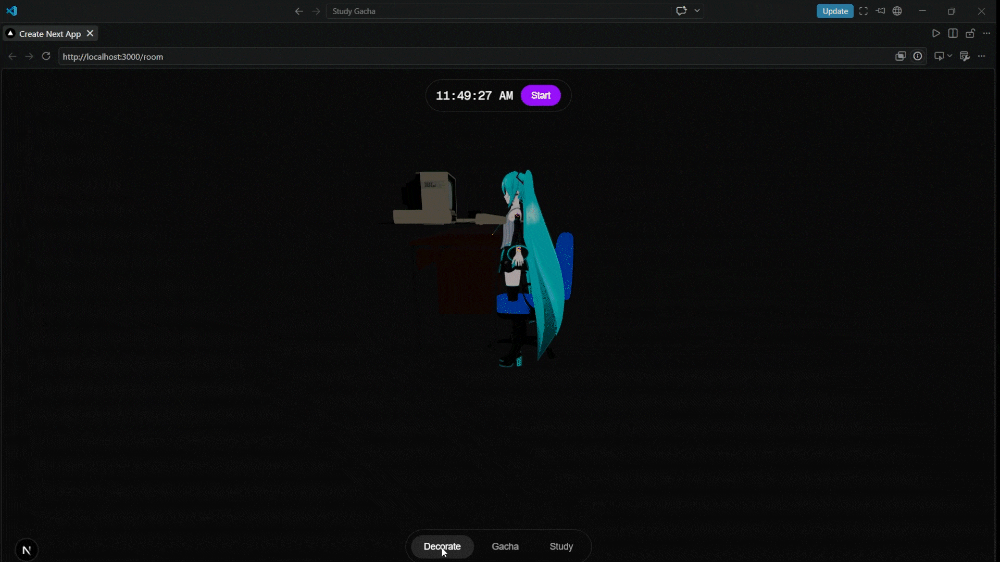

# Study Gacha

A study-productivity application disguised as a gacha game. Users earn in-game currency through focused study sessions and completed tasks, which can be spent on gacha pulls to unlock characters and furniture for a fully customizable 3D room.

## Core Features & Mechanics

### Study & Focus
Study using a built-in pomodoro-style timer capped at 50 minutes per session, or complete self-created daily/weekly/monthly tasks to earn **pull currency**. 



The reward system uses an exponential curve that heavily favors longer, more focused sessions, scaling up to 100 currency at the 50-minute cap. 



### Gacha System
Spend earned pull currency on randomized gacha pulls to unlock anime-girl characters and room furniture. 



If you pull an item you already own, the duplicate does not stack. Instead, it automatically converts into **furniture currency**.




*(Attempting to pull without enough currency will prevent the transaction)*



### 3D Room Customization
Decorate a fully 3D room built in Blender and rendered with React Three Fiber. Users can customize their space by placing their owned characters and furniture into designated named slots.

## Tech Stack

| Category | Technology |
| :--- | :--- |
| **Frontend** | Next.js (App Router), TypeScript |
| **3D Rendering** | React Three Fiber, drei, Three.js |
| **Backend / Database** | Supabase (Postgres, Auth, Row Level Security) |
| **Styling** | Tailwind CSS |

## Core Architecture

### Room & Slot System
The 3D room relies on a single `.glb` file exported from Blender. It contains structural geometry (walls, floor, window) alongside named **marker Empties** (e.g., `DeskSlot`, `ChairSlot`, `MikuSlot`, `Shelf1Slot`). These empties contain no geometry, only transform data.

At runtime:
1. `useGLTF` loads the shell and exposes its `nodes`.
2. `extractSlotsFromNode(nodes)` traverses the nodes, matching marker names against a configuration (`slotMarkerConfig`) using exact-name and prefix-based rules. It produces typed arrays (`CharacterSlot[]`, `FurnitureSlot[]`). Position and rotation data are derived exclusively from the `.glb`.
3. `applySavedOccupancy(slots, savedOccupancy)` overlays the user's persistent `room_slots` data onto the `.glb` defaults.
4. Actual models are loaded from their own `.glb` files via registries (`characterRegistry`, `furnitureRegistry`) keyed by ID, rendering directly into each slot's transform.

This architecture ensures that adding a new room requires zero new code—only a new exported shell utilizing the same marker-naming convention.



### Task System
In addition to the study room, users are also able to add tasks to to their todo list. Completing the task will also give rewards based on how long the task took, There are a few slots users must fill out.

| Field | Purpose |
| :--- | :--- |
| `title` | The name of the task. |
| `Repetition` | Options of Daily, Weekly, and Monthly. The longer the time period, the greater the rewards. |
| `Est Minutes` | The estimated number of minutes that the task should take. Rewards are currently given based on a combination of this and `Repetition` |


### Data Model

| Table | Purpose |
| :--- | :--- |
| `profiles` | Tracks per-user `pull_currency` and `furniture_currency` balances. Auto-created via a trigger on user signup. |
| `owned_characters` / `owned_furniture` | Permanent ownership records generated from gacha pulls. |
| `room_slots` | Tracks per-user, per-slot occupancy (`slot_id` → `occupant_id`). Only stores variable user data, never position/rotation data. |
| `study_sessions` / `tasks` | Logs of completed study sessions and tasks, including the currency awarded for each. |

**Security:** All tables utilize Row Level Security (RLS) to ensure users can only read and write their own rows. Operations that affect currency (gacha pulls, session/task rewards) are routed through `SECURITY DEFINER` Postgres functions (`execute_pull`, `log_study_session`, `complete_task`) called via RPC. This prevents direct client-side manipulation of balances.

### Currency Curve
Both study sessions and task completions calculate rewards using a back-loaded exponential equation:

```text
reward = round((min(minutes, 50) / 50)² × 100)
```

The final minutes approaching the 50-minute cap yield disproportionately higher rewards than the initial minutes, heavily incentivizing sustained focus.

## App Structure

- `/` — Landing page
- `/login`, `/signup` — Authentication
- `/room` — The core application interface: a persistent 3D room layered behind a permanent `<Canvas>`, featuring a floating bottom tab bar (Decorate / Gacha / Tasks) and a top pomodoro timer/clock.

## Known Limitations

- **Single Room Restriction:** The current prototype features a single hardcoded room. The multi-room architecture is built but not yet exposed.
- **Client-Facing Update Policy:** The `profiles` table currently possesses a client-facing `UPDATE` policy that is not fully locked down against balance tampering. This is temporarily mitigated by routing all standard currency changes through `SECURITY DEFINER` functions.
- **Auth Bypass:** Email confirmation on signup is disabled to expedite prototype testing.
- **Asset Cleanup:** Blender source scenes require cleanup (separating reference geometry from exported shells) before additional rooms can be integrated smoothly.
- **Placeholder Assets:** UI and art assets are currently in a barebones prototype state and will be updated in future iterations.
